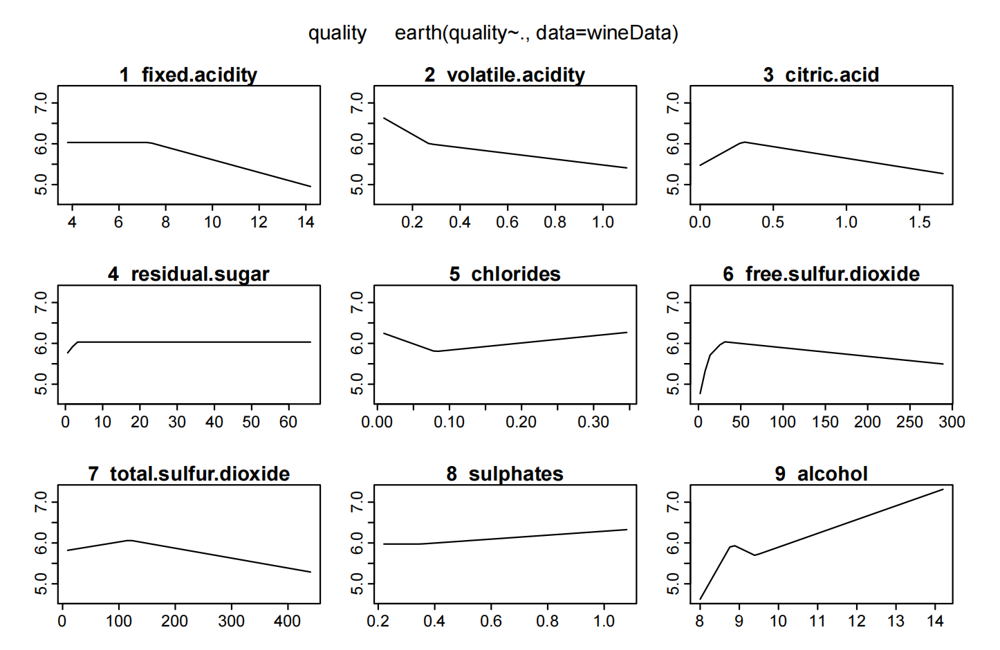

# 📊 Campaign Analysis and Marketing Effectiveness  

This repository explores how to evaluate and improve marketing campaigns using real-world datasets and analytics techniques. A **campaign** can take different forms — from targeting potential customers with telemarketing calls to testing promotional discounts on consumer products. 

Regardless of the form, the central challenge is the same: **understanding what works, for whom, and why.**  

## 🔍 Motivation  
Modern marketing is data-driven. Companies invest heavily in campaigns but often struggle to measure their impact. Were sales driven by the campaign, or by external trends? Did targeting the right customers make a difference? Would a promotional offer increase revenue, or only shift existing demand? These questions sit at the heart of campaign analytics.  

## 📈 Analytical Approaches  
In this project, I applied a range of quantitative methods to different campaign settings. Each method addresses a piece of the broader problem of **campaign effectiveness**:  

- **Targeting and Prediction**: Using classification models to identify which customers are most likely to respond to a campaign (e.g., logistic regression, decision trees).  
- **Promotion and Pricing**: Testing different offers and pricing strategies to estimate how promotions affect demand and profitability.  
- **Causal Inference**: Distinguishing true cause-and-effect relationships from mere correlations by using techniques like randomized experiments and observational data analysis.  

### 1. Framing the Problem  
Every campaign starts with a business objective: increasing sales, shifting customer behavior, or improving brand engagement. But measuring whether it worked is not straightforward. A spike in sales after a promotion, or higher prescriptions after detailing, might reflect the campaign — or just coincidence, seasonality, or targeting biases.  

The first step is always to **clarify what “effectiveness” means**:  
- Is it about conversion probability?  
- Is it about causal impact on behavior?  
- Is it about profitability after accounting for costs?  

### 2. Data as a Lens  
The data in these projects range from bank customer profiles, to physician prescription histories, to retail wine sales. Each dataset has limits and biases, but all share the challenge of separating **signal from noise**.  

- **Customer-level data** lets us predict who is likely to respond.  
- **Observational sales data** forces us to confront endogeneity (the fact that targeting is not random).  
- **Store-level panel data** allows quasi-experiments by comparing treated and untreated groups.  

The analytical mindset is not just to fit models, but to ask: *what kind of variation in the data actually identifies the effect we care about?*

### 3. Methods as Tools  
Across cases, a variety of methods come into play:  
- **Predictive models** (e.g., logistic regression, decision trees) to rank customers by likelihood of response.  
- **Causal inference methods** (e.g., instrumental variables, difference-in-differences) to uncover cause-and-effect rather than mere correlation.  
- **Profitability and ROI analysis** to translate statistical findings into business terms.  

The general principle is:  
- Use **prediction** when the goal is *who to target*.  
- Use **causality** when the goal is *whether targeting works*.  
- Use **profitability** when the goal is *whether it’s worth it*.  

---

## 🛠️ Tools & Techniques  
The analyses were carried out using Python and R, with a focus on:  
| Category                         | Methods / Tools                                                                 | R Packages / Libraries                                     |
|----------------------------------|---------------------------------------------------------------------------------|------------------------------------------------------------|
| **Statistical & Econometric**    | Logistic Regression, Classification Models, A/B Testing, ROI & Profitability    | `stats`, `glm`, `glmnet`, `caret`                          |
| **Machine Learning**              | Decision Trees, Random Forests, Feature Importance                              | `randomForest`, `caret`                                    |
| **Causal Inference**             | Instrumental Variables (IV), Difference-in-Differences (DiD), Matching, Regression Adjustment | `AER`, `MatchIt`, `lmtest`, `sandwich`                    |
| **Data Handling & Visualization** | Data cleaning, manipulation, plotting, exploratory data analysis (EDA)          | `tidyverse` (`dplyr`, `ggplot2`, `tidyr`, `readr`)         |
| **Model Reporting**              | Regression tables, model summaries, reporting for decision-makers                | `stargazer`, `modelsummary`                                |
| **Workflow & Validation**        | Train/test split, cross-validation, interpretation of effect sizes               | Built-in validation functions from `caret`, custom scripts |

## 📚 Learning Outcomes  
By comparing cases across industries — banking, consumer goods, and healthcare — this repository demonstrates how campaign analysis is not only about running models, but also about connecting results to strategy. The ultimate goal is to help decision makers answer:  

- *Who should we target?*  
- *Which offers are profitable?*  
- *How do we know if the campaign really worked?*  

## 🚀 Takeaway  
Campaign analytics blends statistics, machine learning, and business intuition. Through these assignments and cases, I practiced how to move from raw customer data to insights that directly inform **marketing strategy and ROI.**  
